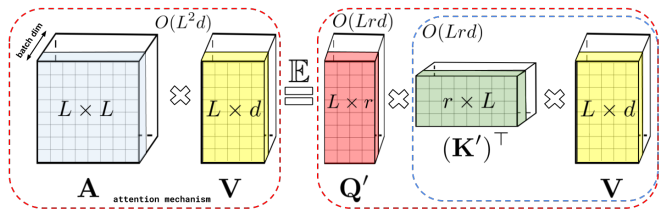
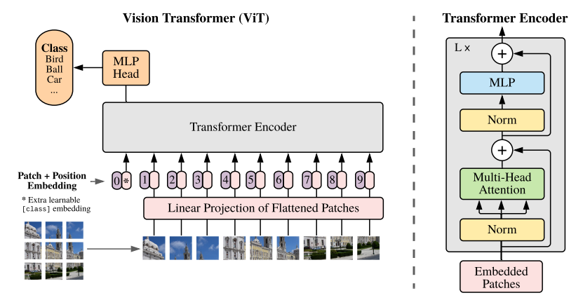
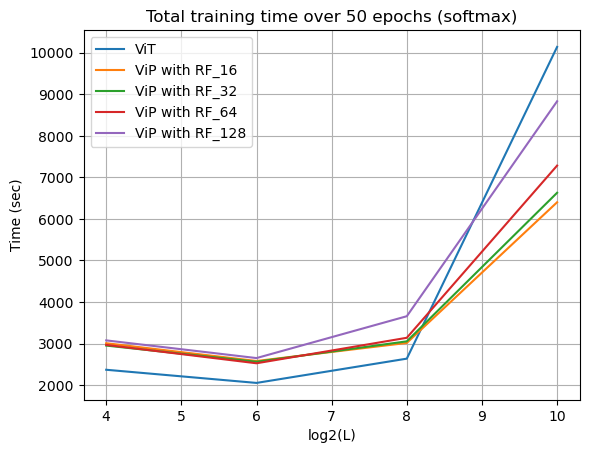
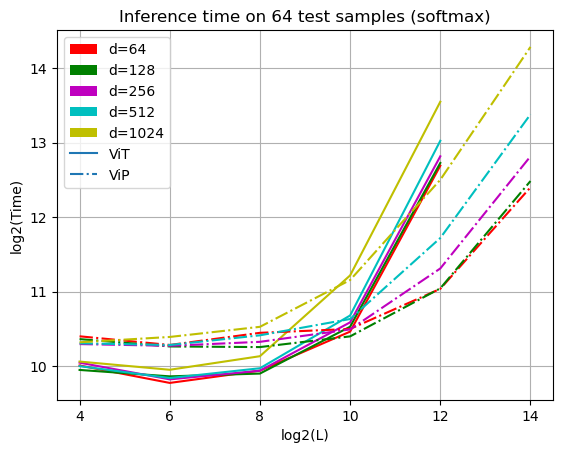

# Vision Performer v.s. Vision Transformer
In this project, I introduce Vision Performer (ViP), a Vision Transformer (ViT) architecture in which the traditional self-attention module is replaced by Performer-based attention. I demonstrate through extensive experiments on two image classification datasets from TensorFlow Datasets, CiFAR10 and Fashion-MNIST. Specifically, I implement ViT and ViP and compare their performance in terms of both accuracy and speed. In addition, two different Performer kernel transformations are conducted, namely, softmax-kernel and ReLu-kernel, with various numbers of random features m = 16,32,64,128. The results show that ViP outperforms ViT, showcasing the effectiveness of the novel attention mechanism leveraged by Performer.

